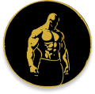

  <h1>DEJAVU</h1>

  Welcome to <b>Dejavu</b>'s GitHub Organization! We are a team of highly motivated students participating in the <u>Bangkit 2024 Batch 2 Capstone Project</u>. Our mission is to leverage our skills in Mobile Development, Cloud Computing, and Machine Learning to build impactful solutions for real-world problems.

---

## 🎯 Project Overview

**Project Name**: _GYMER_

**Project Goal**:  
Our goal is to create a solution that addresses **Health Innovation: Empowering Vulnerable Communities for Health and Well-being** by utilizing a combination of cutting-edge **Machine Learning**, **Cloud Computing**, and **Mobile Development** technologies. Through our project, we aim to deliver an easy-to-use educational tool that empowers users, especially tech-savvy Gen Z, to exercise with confidence and efficiency.

---

## 🧑‍💻 Team Members

|               Name                |         Role          |                Contact Link                |
| :-------------------------------: | :-------------------: | :----------------------------------------: |
|         Putu Arka Adiana          |   Machine Learning    |  [GitHub](https://github.com/arkaadiana)   |
|      Made Praba Jaya Kusuma       |   Machine Learning    |   [GitHub](https://github.com/mdepraba)    |
|          Putu Tio Lovan           |   Machine Learning    |  [GitHub](https://github.com/Tiolovan07)   |
|       Dicky Zaldy Haryanto        |    Cloud Computing    | [GitHub](https://github.com/Deku077-zaldy) |
|   I Komang Raditia Galang Buana   |    Cloud Computing    | [GitHub](https://github.com/Galangbuana12) |
| I Nyoman Danu Daksawan Randysmara |  Mobile Development   | [GitHub](https://github.com/DanuDaksawan)  |
|     Kadek Bayu Satria Maryana     |  Mobile Development   | [GitHub](https://github.com/BayuSatria14)  |

---

# GYMER

## 📖 Background
We created GYMER to help gym enthusiasts track their progress and reduce the risk of injury caused by improper equipment use. By simply taking a photo of gym equipment, users can instantly access detailed information and exercise guidance, making workouts safer and more effective.

---

## ✨ Features

1. **Gym Equipment Recognition**
   - Snap a photo of gym equipment to identify its name.
   - Access exercises with step-by-step guides for proper usage and safety.

2. **Exercise Planner & Progress Tracker**
   - Create personalized workout plans.
   - Save activity results and track progress over time to achieve fitness goals.

---

## 📂 Dataset Classification
The application recognizes and categorizes the following types of gym equipment:

- Chest Fly Machine
- Dumbbell
- Lat Pull Down Machine
- Leg Extension Machine
- Leg Press Machine
- Seated Row Machine
- Smith Machine
- Treadmill
